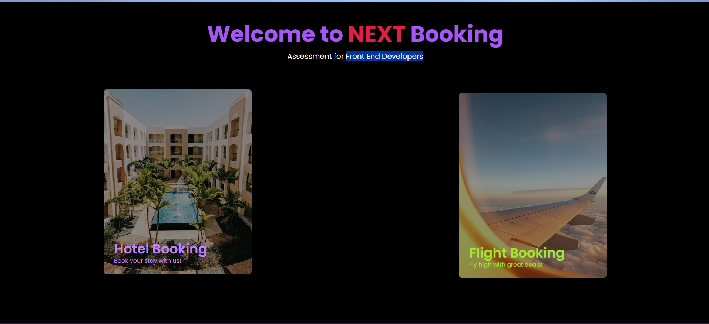
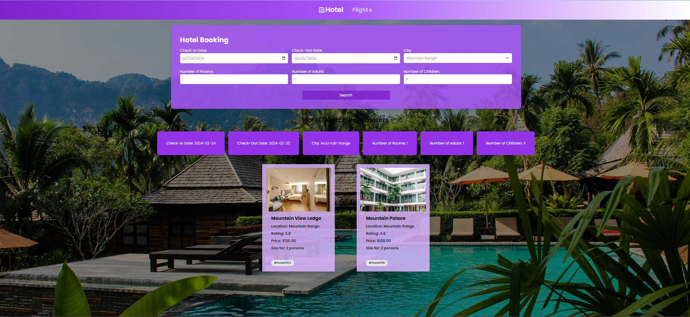
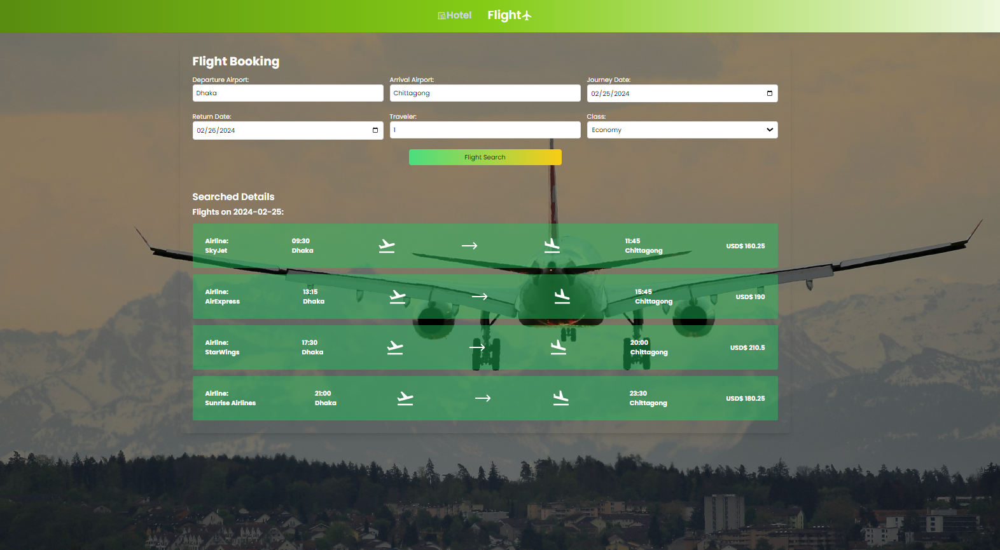

# Next Booking - Front End Developer Selection Process

Welcome to the Next Booking project! This project is designed as part of the selection process for Front End Developers interested in joining Next Venture.

## Overview

Next Booking is a web application that allows users to book hotels and flights. It's a simple yet powerful tool that showcases my skills in front-end development.

## Screenshots


*Home page*


*Hotel Booking Part*

*Flight Booking Part*


## User View

<!-- Describe the user view and features of my application -->

## Getting Started

Follow the steps below to get the project up and running on my local machine.

### Prerequisites

- Node.js installed

### Clone the Repository

```bash
git clone https://github.com/Mushfiq80/Next_Booking.git

Navigate to the Project Directory
$cd Next_Booking

Install Dependencies if needed
$npm install

$npm run dev
Visit http://localhost:3000 or default location in my web browser to view the application.

Technologies Used
React
Tailwind CSS
Vanilla CSS
Other technologies...

Developed By,
Mohammad Mushfiq Us Saleheen
aurpon10@gmail.com


